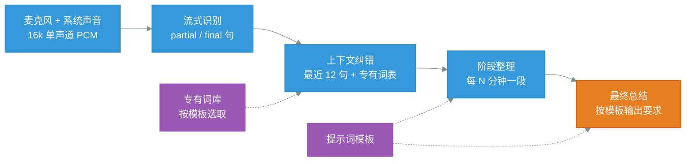
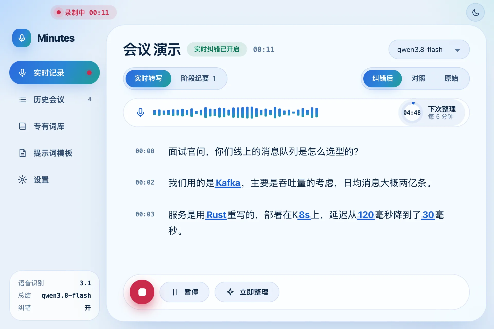
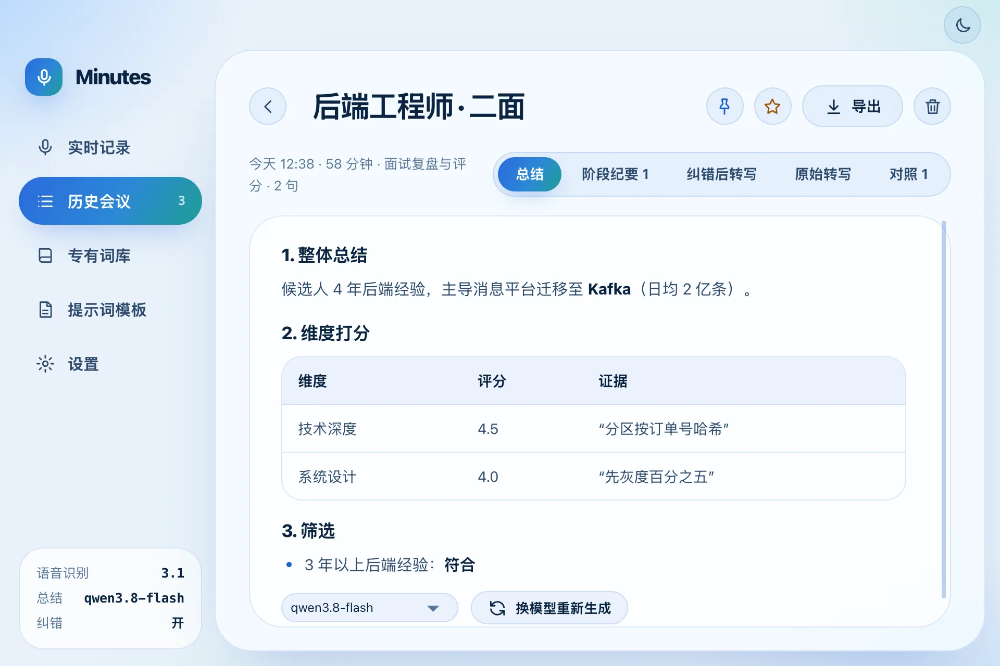
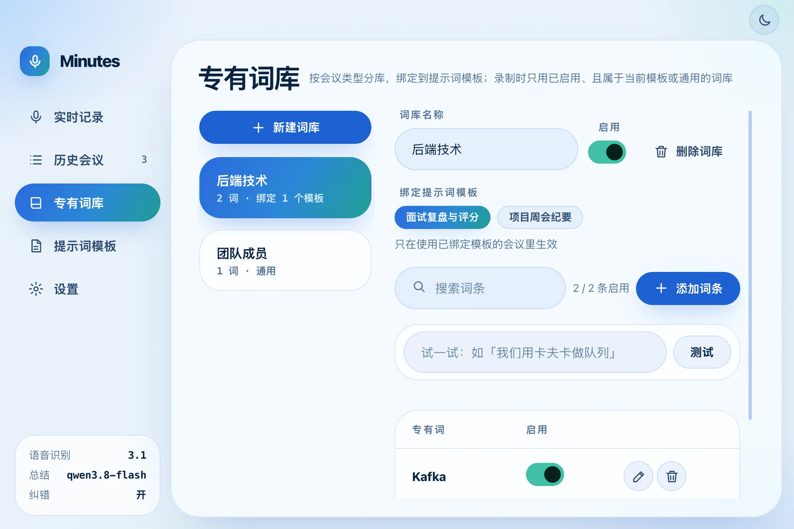
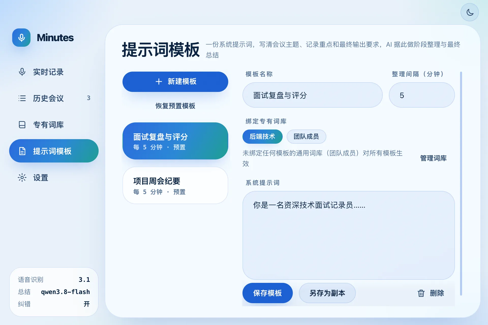

<p align="center">
  
  
  
  
</p>

# Minutes

实时会议纪要工具，**把会议写成笔记**。

一边开会一边出字：会议声音实时转成文字，AI 结合上下文和专有词库纠正识别错误，每隔几分钟整理一段阶段纪要，散会时按你写的提示词生成最终总结。录音不落盘，转写、纪要、总结都存在本机，可以搜索、收藏、导出。


## 一、功能说明

| 页面 | 能做什么 |
| --- | --- |
| 实时记录 | 选提示词模板和模型后开始录制；转写逐字出现，纠错处高亮；阶段纪要实时追加； |
| 历史会议 | 换模型重新生成总结、导出 Markdown 或复制； |
| 专有词库 | 按会议类型建多个词库，各自启用 / 停用，绑定到提示词模板；    |
| 提示词模板 | 预置「面试复盘与评分」「项目周会纪要」「通用会议纪要」 |
| 设置 | 百炼密钥与连接测试；识别、总结、纠错模型切换，可添加任意百炼对话模型； |

音频来源默认是**麦克风 + 系统声音**：自己说的话和耳机里线上会议对方的声音会一起转写。


## 二、工作原理



- **采集**：同时采集麦克风和系统声音（对默认输出设备做回环），混音后重采样为 16k 单声道 PCM16，每 100ms 一包发给识别服务；暂停时发送静音保持连接，系统声音不可用时自动只用麦克风。
- **识别**：百炼流式语音识别（WebSocket），未说完的 partial 句实时显示，说完的 final 句写库；连接断开自动重连。
- **纠错**：每个 final 句先以原文立即显示，同时异步交给低延迟对话模型。模型的依据有两样：最近 12 句对话的上下文，和本场会议的专有词表。超时（默认 2.5 秒）或改动幅度超过上限就保留原文，不会把句子改得面目全非。
- **阶段整理**：每隔模板设定的分钟数（默认 5），把这段新增转写连同前几段阶段纪要交给总结模型，按模板提示词整理成要点；失败了下次会带上累积内容重试。
- **最终总结**：结束录制后先等纠错收尾，整理最后一段，再依据全部阶段纪要（转写不长时附上全文）按模板的输出要求生成总结。
- **存储**：ASR 原始转写和纠错后文本分开保存，可以分别导出，也能导出逐处标注的纠错对照。


### 专有词库+上下文纠错

语音识别常把专有名词识别成读音相近的字，或者英文的中文音译，比如把 Kafka 识别成「卡夫卡」，把「灰度发布」识别成「辉度发布」。

所以根据专有词库+上下文对 ASR 转写记录实时纠错。

每场会议用哪些词库，由所选模板决定。


## 三、界面预览

**实时记录**：转写逐字出现，纠错处带下划线高亮



**历史会议**：总结、阶段纪要



**专有词库**：多个词库，各自启用并绑定模板



**提示词模板**：一份系统提示词，勾选绑定的词库




## 四、安装、配置和使用

### 安装

需要 Rust（stable）和 Node.js（用于 Tauri CLI）。

```bash
npm install
npm run build     # 产物在 src-tauri/target/release/bundle/
```

开发时用 `npm run dev` 直接运行。语音识别和总结走云端，应用本身不带模型，打包后约 4 MB。

macOS 首次录制会请求「麦克风」和「系统音频录制」两项权限；采集系统声音需要 macOS 14.6 及以上。


### 配置

在应用「设置」里填百炼密钥即可。也可以写进 `.env`（参考 `.env.example`），启动时依次从当前目录、可执行文件目录、应用数据目录读取，设置里填的值优先：

| 变量 | 说明 |
| --- | --- |
| `BAILIAN_API_KEY` | 百炼密钥 |
| `BAILIAN_WORKSPACE_ID` | 可选，业务空间 ID；填了走 `{id}.cn-beijing.maas.aliyuncs.com`，否则走 `dashscope.aliyuncs.com` |

默认模型：

| 能力 | 默认型号 | 可选 |
| --- | --- | --- |
| 语音识别（流式） | `qwen-audio-3.1-asr-flash-streaming` | `qwen-audio-3.0-asr-flash-streaming`、`fun-asr-realtime` |
| 阶段整理 / 最终总结 | `qwen3.8-flash` | `qwen3.7-flash-2026-07-15`、`qwen-plus`、`qwen-max`、`qwen-turbo`，以及在设置里添加的任意百炼对话模型 |
| 上下文纠错 | `qwen3.7-flash-2026-07-15` | 同上，选低延迟型号 |


### 使用

1. 到「专有词库」新建词库，把会议里常出现的人名、产品名、术语整段粘贴进去；需要的话绑定到对应模板。
2. 到「提示词模板」选一个预置模板，或者自己写一份系统提示词，说明会议主题、要记什么、最后要输出什么。
3. 回到「实时记录」，选模板，点「开始录制」。模板卡片下方会列出这场会议要用的词库。
4. 结束后在「历史会议」查看总结，不满意可以换模型重新生成，再导出 Markdown。


### 开发与调试

```bash
cd src-tauri
cargo test --lib                                      # 单元测试：词表分词、改动幅度、词库选取与旧数据迁移
cargo run --example capture -- system                # 音频采集自检：播放声音时 peak 应明显大于 0
cargo run --example headless -- /path/to/16k.wav 22   # 无界面联调：WAV → 识别 → 纠错 → 阶段整理 → 总结
```

`npm run preview` 在浏览器里打开界面（`http://localhost:1420`），后端由 `src/js/mock.js` 模拟。


## 六、数据与隐私

| 数据 | 位置 |
| --- | --- |
| 会议、转写、阶段纪要、总结、词库、模板、设置 | 应用数据目录下的 `meeting.db`（macOS：`~/Library/Application Support/com.meetingnotes.app/`） |
| 音频 | 不落盘，只以流的形式发送到你配置的百炼服务 |
